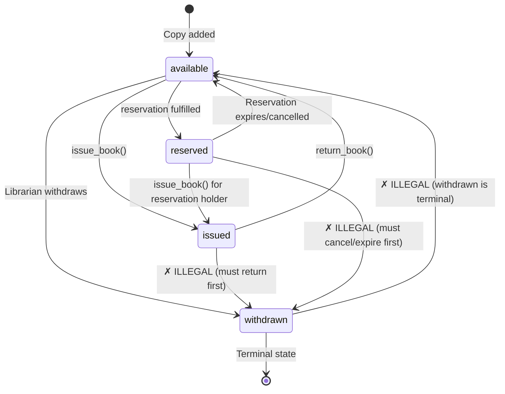
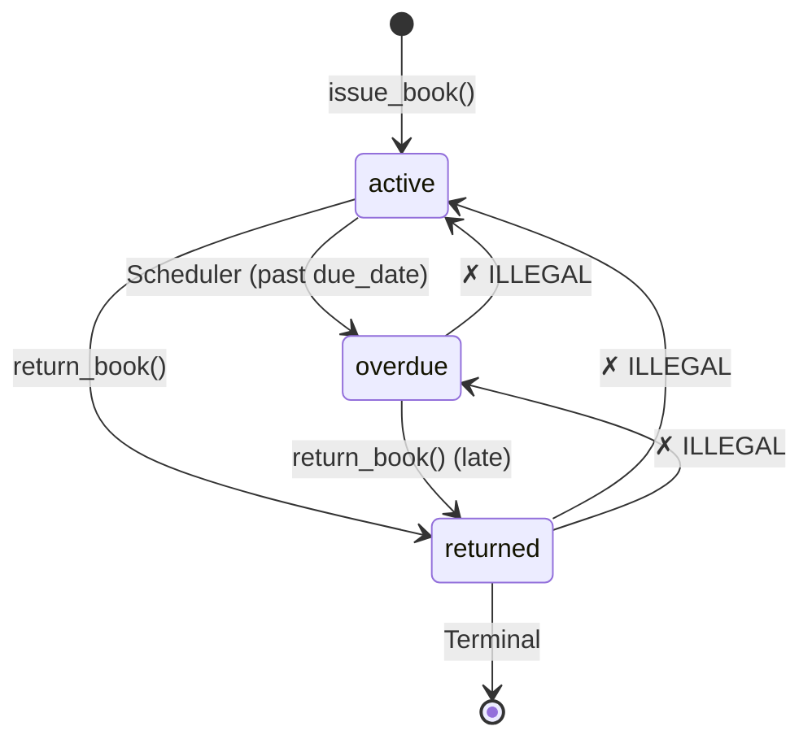
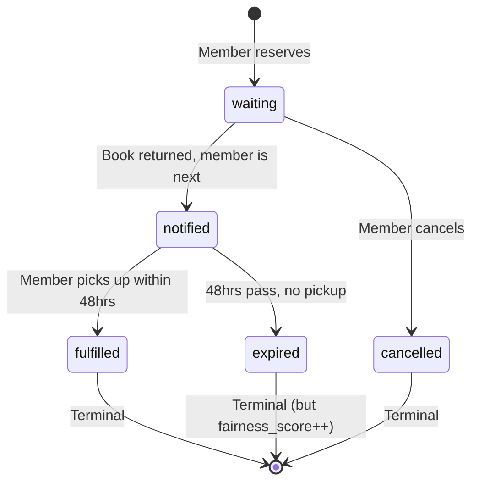
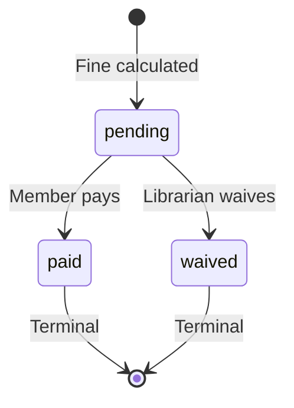

# LIBRA Architecture Review — Principal Engineer Assessment

> [!IMPORTANT]
> This review treats the blueprint as a production specification. Every finding below is something a Frappe senior engineer would probe during a code walkthrough. Address these before writing implementation code.

---

## 1. CRITICAL EDGE CASES: Race Conditions & Transaction Integrity

### 1.1 The Return-vs-Overdue-Job Race (Severity: DATA CORRUPTION)

**The scenario:** At midnight, APScheduler fires `overdue_check()`. It queries all `transactions` where `status='active' AND due_date < today`. Meanwhile, a librarian processes a return for one of those same transactions at 12:00:01 AM.

**What goes wrong without protection:**

```
Timeline:
  T1  [Scheduler]  SELECT * FROM transactions WHERE status='active' AND due_date < NOW()
                    → finds transaction #42 (Rahul's book, due yesterday)
  T2  [Librarian]  return_book(transaction_id=42)
                    → sets status='returned', returned_at=NOW()
                    → increments available_copies
                    → checks reservation queue, notifies next member
  T3  [Scheduler]  UPDATE transactions SET status='overdue' WHERE id=42
                    → OVERWRITES the 'returned' status with 'overdue'
```

**Result:** Transaction #42 is now `status='overdue'` but has a `returned_at` timestamp. The `available_copies` counter was incremented (the book is on the shelf), but the transaction says it's overdue. A fine may be calculated against a returned book. The reservation notification already fired, so the next member thinks the book is available — and it is, but the data says otherwise.

**The fix — `SELECT FOR UPDATE` with status re-check:**

```python
# services/issue_service.py — return_book()
def return_book(transaction_id: int, librarian_id: int) -> ServiceResult:
    try:
        # Lock the transaction row — any concurrent writer blocks here
        txn = db.session.execute(
            db.select(Transaction)
            .where(Transaction.id == transaction_id)
            .with_for_update()
        ).scalar_one_or_none()

        if txn is None:
            return ServiceResult.fail("Transaction not found")

        # Re-check status AFTER acquiring the lock
        if txn.status == 'returned':
            return ServiceResult.fail("Book already returned")

        if txn.status not in ('active', 'overdue'):
            return ServiceResult.fail(f"Cannot return a transaction in '{txn.status}' state")

        # Now safe to mutate — we hold the row lock
        txn.status = 'returned'
        txn.returned_at = datetime.utcnow()
        txn.returned_by = librarian_id

        # Lock the copy row too before mutating
        copy = db.session.execute(
            db.select(BookCopy)
            .where(BookCopy.id == txn.copy_id)
            .with_for_update()
        ).scalar_one()
        copy.status = 'available'

        # Lock the book row for counter update
        book = db.session.execute(
            db.select(Book)
            .where(Book.id == copy.book_id)
            .with_for_update()
        ).scalar_one()
        book.available_copies += 1

        # Fine calculation, audit, reservation check...
        db.session.commit()
        return ServiceResult.ok(txn)

    except Exception as e:
        db.session.rollback()
        raise
```

**And the scheduler must also lock:**

```python
# tasks/scheduler.py — overdue_check()
def overdue_check():
    with app.app_context():
        # Use a single transaction with row locks
        overdue_txns = db.session.execute(
            db.select(Transaction)
            .where(
                Transaction.status == 'active',
                Transaction.due_date < date.today()
            )
            .with_for_update(skip_locked=True)  # CRITICAL: skip rows being processed
        ).scalars().all()

        for txn in overdue_txns:
            # Re-check after lock acquisition
            if txn.status == 'active':
                txn.status = 'overdue'

        db.session.commit()
```

> [!CAUTION]
> The `skip_locked=True` is essential. Without it, the scheduler blocks on any row a librarian is currently returning, which can cause the scheduler job to hang until the librarian's transaction commits. With `skip_locked`, it simply skips those rows — they'll be caught in tomorrow's run if still active, or they'll already be returned.

### 1.2 The Double-Issue Race (Severity: PHANTOM COPY)

**The scenario:** Two librarians simultaneously try to issue the last available copy of a popular book to two different members.

```
T1  [Librarian A]  copy = BookCopy.query.filter_by(book_id=5, status='available').first()
                    → gets copy #7
T2  [Librarian B]  copy = BookCopy.query.filter_by(book_id=5, status='available').first()
                    → ALSO gets copy #7 (not yet committed by A)
T3  [Librarian A]  copy.status = 'issued', creates transaction for Member X
T4  [Librarian B]  copy.status = 'issued', creates transaction for Member Y
T5  Both commit → Two transactions reference copy #7, available_copies goes to -1
```

**The fix:**

```python
def issue_book(member_id: int, book_id: int, librarian_id: int) -> ServiceResult:
    # Lock an available copy atomically — first one to lock wins
    copy = db.session.execute(
        db.select(BookCopy)
        .where(BookCopy.book_id == book_id, BookCopy.status == 'available')
        .with_for_update(skip_locked=True)  # skip copies another txn is locking
        .limit(1)
    ).scalar_one_or_none()

    if copy is None:
        return ServiceResult.fail("No available copies")

    copy.status = 'issued'
    # ... create transaction, decrement counter ...
```

### 1.3 The Reservation-Fulfillment Race (Severity: QUEUE CORRUPTION)

**The scenario:** A book is returned. The service checks the reservation queue and finds Member A at position 1. Concurrently, Member A cancels their reservation.

**The fix:** Lock the reservation row with `FOR UPDATE` before changing its status to `fulfilled`. Re-check the status after acquiring the lock. If it's been cancelled, move to the next in queue.

### 1.4 The Counter-Drift Problem (Severity: SLOW DEGRADATION)

`books.available_copies` is denormalized. Over weeks of concurrent operations, even with locks, there's a risk of counter drift if any code path updates the copy status without updating the counter (e.g., a direct admin SQL fix, a new feature path, a bug in error handling that commits a copy status change but rolls back the counter update).

**Mitigation — Reconciliation job:**

```python
# Add as a third scheduled job (or a CLI command: flask reconcile-counters)
def reconcile_available_copies():
    """Nightly self-healing check for counter drift."""
    books = Book.query.all()
    for book in books:
        actual = BookCopy.query.filter_by(book_id=book.id, status='available').count()
        if book.available_copies != actual:
            logger.warning(
                f"Counter drift detected: book_id={book.id} "
                f"stored={book.available_copies} actual={actual}"
            )
            book.available_copies = actual
    db.session.commit()
```

> [!TIP]
> Alternatively, enforce this with a PostgreSQL trigger. But a nightly reconciliation job is cheaper to debug and explain to evaluators.

---

## 2. SCHEMA REFINEMENTS: Missing Constraints

### 2.1 Missing `CHECK` Constraints

The blueprint uses `VARCHAR` for status/role/tier columns but has **no database-level enforcement** of valid values. The ORM can validate on the Python side, but a raw SQL fix or a migration script could insert garbage.

```sql
-- users
ALTER TABLE users ADD CONSTRAINT chk_users_role
    CHECK (role IN ('admin', 'librarian', 'member'));
ALTER TABLE users ADD CONSTRAINT chk_users_tier
    CHECK (tier IN ('student', 'faculty', 'staff'));

-- book_copies
ALTER TABLE book_copies ADD CONSTRAINT chk_copy_status
    CHECK (status IN ('available', 'issued', 'reserved', 'withdrawn'));

-- transactions
ALTER TABLE transactions ADD CONSTRAINT chk_txn_status
    CHECK (status IN ('active', 'overdue', 'returned'));

-- fines
ALTER TABLE fines ADD CONSTRAINT chk_fine_status
    CHECK (status IN ('pending', 'paid', 'waived'));

-- reservations
ALTER TABLE reservations ADD CONSTRAINT chk_reservation_status
    CHECK (status IN ('waiting', 'notified', 'fulfilled', 'expired', 'cancelled'));

-- books (counter invariant)
ALTER TABLE books ADD CONSTRAINT chk_available_copies_non_negative
    CHECK (available_copies >= 0);
ALTER TABLE books ADD CONSTRAINT chk_total_copies_non_negative
    CHECK (total_copies >= 0);
ALTER TABLE books ADD CONSTRAINT chk_available_lte_total
    CHECK (available_copies <= total_copies);
```

> [!WARNING]
> The `CHECK (available_copies <= total_copies)` constraint will **cause your `issue_book()` to raise an IntegrityError** if you decrement `available_copies` without checking bounds first. This is intentional — it's your last line of defense. Handle the `IntegrityError` in your service layer.

### 2.2 Missing Composite Unique Constraints

```sql
-- A member can only have ONE active/overdue transaction per copy
-- (prevents double-issue to same member for same copy)
CREATE UNIQUE INDEX uq_active_txn_per_copy
    ON transactions (copy_id)
    WHERE status IN ('active', 'overdue');

-- A member can only have ONE active reservation per book
-- (prevents spamming the queue)
CREATE UNIQUE INDEX uq_active_reservation_per_member_book
    ON reservations (member_id, book_id)
    WHERE status IN ('waiting', 'notified');

-- One reading goal per member per year
ALTER TABLE reading_goals ADD CONSTRAINT uq_member_year
    UNIQUE (member_id, year);

-- One active fine policy per tier
CREATE UNIQUE INDEX uq_active_policy_per_tier
    ON fine_policies (applies_to_tier)
    WHERE is_active = TRUE;
```

> [!IMPORTANT]
> The **partial unique index** `uq_active_txn_per_copy` is the most critical one. Without it, the double-issue race in §1.2 can still corrupt data even with application-level locking if there's a bug in your lock logic. This is defense-in-depth.

### 2.3 Missing Indexes for Query Performance

```sql
-- Hot path: "find available copies for this book"
CREATE INDEX idx_copies_book_status ON book_copies (book_id, status);

-- Hot path: "find active/overdue transactions for overdue check"
CREATE INDEX idx_txn_status_due ON transactions (status, due_date)
    WHERE status IN ('active', 'overdue');

-- Hot path: "find waiting reservations for a book, ordered by queue"
CREATE INDEX idx_reservations_book_queue
    ON reservations (book_id, fairness_score DESC, queued_at ASC)
    WHERE status = 'waiting';

-- Member's current borrows
CREATE INDEX idx_txn_member_status ON transactions (member_id, status);

-- Audit log timeline (entity lookup)
CREATE INDEX idx_audit_entity ON audit_log (entity_type, entity_id);

-- Book search (title + author)
CREATE INDEX idx_book_title_trgm ON books USING gin (title gin_trgm_ops);
CREATE INDEX idx_book_author_trgm ON books USING gin (author gin_trgm_ops);
```

> [!NOTE]
> The `gin_trgm_ops` indexes require `CREATE EXTENSION pg_trgm;` and will accelerate your HTMX live search `ILIKE '%query%'` from a sequential scan to an index scan. Without this, the search degrades on 10k+ books.

### 2.4 Missing Column-Level Constraints

```sql
-- transactions: if returned_at is set, status MUST be 'returned'
ALTER TABLE transactions ADD CONSTRAINT chk_returned_consistency
    CHECK (
        (returned_at IS NULL AND status IN ('active', 'overdue'))
        OR
        (returned_at IS NOT NULL AND status = 'returned')
    );

-- fines: paid_at and waived_at are mutually exclusive
ALTER TABLE fines ADD CONSTRAINT chk_fine_resolution_exclusive
    CHECK (NOT (paid_at IS NOT NULL AND waived_at IS NOT NULL));

-- fines: amount must be positive
ALTER TABLE fines ADD CONSTRAINT chk_fine_amount_positive
    CHECK (amount > 0);

-- fine_policies: rate must be positive
ALTER TABLE fine_policies ADD CONSTRAINT chk_rate_positive
    CHECK (rate_per_day > 0);

-- reservations: expires_at should only be set when notified
ALTER TABLE reservations ADD CONSTRAINT chk_expires_only_when_notified
    CHECK (
        (status IN ('waiting', 'cancelled') AND expires_at IS NULL)
        OR
        (status IN ('notified', 'fulfilled', 'expired'))
    );

-- books: published_year sanity check
ALTER TABLE books ADD CONSTRAINT chk_published_year
    CHECK (published_year IS NULL OR (published_year >= 1000 AND published_year <= 2100));

-- isbn: length validation (ISBN-10 or ISBN-13)
ALTER TABLE books ADD CONSTRAINT chk_isbn_length
    CHECK (length(isbn) IN (10, 13));
```

### 2.5 Missing `NOT NULL` Constraints

```sql
-- transactions.due_date is marked NOT NULL ✓
-- But transactions.copy_id and member_id should also be NOT NULL:
ALTER TABLE transactions ALTER COLUMN copy_id SET NOT NULL;
ALTER TABLE transactions ALTER COLUMN member_id SET NOT NULL;
ALTER TABLE transactions ALTER COLUMN issued_by SET NOT NULL;

-- reservations: book_id and member_id must not be null
ALTER TABLE reservations ALTER COLUMN book_id SET NOT NULL;
ALTER TABLE reservations ALTER COLUMN member_id SET NOT NULL;

-- fines.transaction_id must not be null
ALTER TABLE fines ALTER COLUMN transaction_id SET NOT NULL;
```

### 2.6 Missing Foreign Key Behavior

The blueprint only specifies `ON DELETE CASCADE` for `book_copies.book_id`. Other foreign keys silently use `NO ACTION` (default), which means:

- Deleting a `user` who has active transactions → **IntegrityError** (correct behavior, but undocumented)
- Deleting a `book` cascades to all copies, but those copies have transactions referencing them → **IntegrityError**

**Recommendation:** Explicitly document the intended FK behavior:

| FK | ON DELETE |
|----|-----------|
| `book_copies.book_id → books.id` | `CASCADE` (blueprint has this ✓) |
| `transactions.copy_id → book_copies.id` | `RESTRICT` — never delete a copy that has transactions |
| `transactions.member_id → users.id` | `RESTRICT` — never delete a member with transaction history |
| `transactions.issued_by → users.id` | `SET NULL` — librarian account may be deactivated |
| `fines.transaction_id → transactions.id` | `CASCADE` — if a transaction is deleted (admin fix), its fines go too |
| `reservations.book_id → books.id` | `CASCADE` — if a book is removed, its reservations are meaningless |
| `reservations.member_id → users.id` | `RESTRICT` — don't delete members with active reservations |
| `audit_log.actor_id → users.id` | `SET NULL` — audit survives user deletion |

> [!CAUTION]
> Your blueprint says a librarian "deletes the copy row" for damaged books. But `transactions.copy_id → book_copies.id` with no `ON DELETE` policy will block this if any transaction ever referenced that copy. You need either `ON DELETE SET NULL` (lose the copy linkage in history) or a `WITHDRAWN` status instead of deletion (recommended — never delete data).

---

## 3. STATE MACHINE VALIDATION

### 3.1 BookCopy Status FSM



**Illegal transitions the blueprint doesn't explicitly block:**

| From | To | Why It's Illegal | How It Could Happen |
|------|----|------------------|---------------------|
| `issued` | `withdrawn` | A book that's with a member can't be withdrawn. Must be returned first. | Librarian tries to withdraw a copy without checking if it's issued. |
| `issued` | `reserved` | Can't reserve a copy that's already issued. | Bug in reservation fulfillment logic. |
| `reserved` | `withdrawn` | A reserved copy has a commitment to a member. Must cancel/expire the reservation first. | Admin tries to withdraw, not seeing the reservation. |
| `withdrawn` | any | Withdrawn is terminal. | Librarian tries to "re-add" a withdrawn copy instead of creating a new one. |
| `available` | `available` | No-op but could mask a bug if return_book() is called twice. | Idempotency failure. |

**Enforcement in the service layer:**

```python
VALID_COPY_TRANSITIONS = {
    'available': {'issued', 'reserved', 'withdrawn'},
    'issued':    {'available'},        # return only
    'reserved':  {'issued', 'available'},  # issue to reserver, or release
    'withdrawn': set(),                # terminal, no transitions out
}

def _validate_copy_transition(copy: BookCopy, new_status: str):
    allowed = VALID_COPY_TRANSITIONS.get(copy.status, set())
    if new_status not in allowed:
        raise IllegalStateTransition(
            f"Cannot transition copy #{copy.id} from '{copy.status}' to '{new_status}'"
        )
```

### 3.2 Transaction Status FSM



**Critical gap:** The blueprint says the scheduler marks transactions as `overdue`, but `return_book()` only checks for `status='active'` implicitly (line 219: `status VARCHAR(20) DEFAULT 'active'`). If a transaction is already `overdue`, can it be returned?

**Answer: YES, it must.** A late return is still a return. The `return_book()` function must accept both `active` and `overdue` as valid pre-states. The fine calculation triggers when `status was 'overdue'` at return time.

**Enforcement:**

```python
VALID_TXN_TRANSITIONS = {
    'active':   {'overdue', 'returned'},
    'overdue':  {'returned'},
    'returned': set(),  # terminal
}
```

### 3.3 Reservation Status FSM



**Illegal transitions not blocked:**

| From | To | Risk |
|------|----|------|
| `waiting` → `fulfilled` | Skipping notification — member didn't get 48hr window | Service bug bypassing the notify step |
| `waiting` → `expired` | Can't expire what was never notified | Scheduler bug |
| `notified` → `waiting` | Going backwards | Manual admin override without state machine |
| `notified` → `cancelled` | **Debatable** — should a notified member be able to cancel? Blueprint is silent. | UX ambiguity |

> [!IMPORTANT]
> **Design decision needed:** Can a member cancel a reservation that's already in `notified` status? If yes, the copy should return to `available` and the queue should advance. If no, they must either pick it up or let it expire. I recommend **allowing cancellation from `notified`** — it's better UX and frees the book faster.

### 3.4 Fine Status FSM



**Gap:** Can a partially paid fine exist? The blueprint mentions "partial payments" in the reasoning (line 239: "multiple fine events") but the `fines` schema has a single `amount` and `paid_at`. If partial payments are in scope, you need a `fine_payments` junction table. If not, make the fine atomic — paid in full or waived.

**Recommendation:** For a 4–5 day build, **no partial payments**. Fine is paid in full or waived. Document this explicitly and remove the "partial payments" mention from the blueprint to avoid evaluator confusion.

---

## 4. FRAPPE ALIGNMENT: Service Layer → DocType Controllers

### 4.1 The Mental Model

In Frappe, business logic lives in **DocType Controller methods** — Python classes that correspond to database tables. The key lifecycle hooks are:

| Frappe Hook | When It Fires | Your Flask Equivalent |
|-------------|---------------|-----------------------|
| `before_insert()` | Before new record is saved | Service method that validates + creates |
| `after_insert()` | After INSERT committed | Audit logging, notification triggers |
| `validate()` | Before any save (insert or update) | State machine validation |
| `before_save()` | Just before UPDATE | Pre-mutation checks |
| `on_update()` | After UPDATE committed | Counter updates, queue advancement |
| `before_submit()` | Before workflow submission | Transition validation |
| `on_submit()` | After submission | Side-effects (emails, counter sync) |
| `on_cancel()` | After cancellation | Reverse side-effects |

### 4.2 Structuring Services for Migration

Instead of monolithic functions, structure each service as a class with methods that map to Frappe lifecycle hooks:

```python
# services/issue_service.py — FRAPPE-ALIGNED STRUCTURE

class IssueService:
    """
    Maps to Frappe's Transaction DocType controller.
    
    Frappe migration:
      - validate()        → self._validate_issue()
      - before_submit()   → self._check_borrow_limits()
      - on_submit()       → self._execute_issue()
      - on_cancel()       → self.return_book()
    """

    @staticmethod
    def validate_issue(member_id: int, book_id: int) -> ServiceResult:
        """Frappe equivalent: validate() — pure checks, no mutations."""
        member = User.query.get(member_id)
        if not member or member.role != 'member':
            return ServiceResult.fail("Invalid member")
        if not member.is_active:
            return ServiceResult.fail("Member account is deactivated")

        book = Book.query.get(book_id)
        if not book or book.available_copies <= 0:
            return ServiceResult.fail("No available copies")

        # Check borrow limit for tier
        active_count = Transaction.query.filter_by(
            member_id=member_id, status='active'
        ).count()
        if active_count >= BORROW_LIMITS[member.tier]:
            return ServiceResult.fail("Borrow limit reached")

        # Check for unpaid fines
        unpaid = Fine.query.join(Transaction).filter(
            Transaction.member_id == member_id,
            Fine.status == 'pending'
        ).count()
        if unpaid > 0:
            return ServiceResult.fail("Unpaid fines exist")

        return ServiceResult.ok()

    @staticmethod
    def execute_issue(member_id: int, book_id: int, librarian_id: int) -> ServiceResult:
        """Frappe equivalent: on_submit() — mutations inside a transaction."""
        validation = IssueService.validate_issue(member_id, book_id)
        if not validation.success:
            return validation

        # ... locking + mutation logic from §1.2 ...

    @staticmethod
    def return_book(transaction_id: int, librarian_id: int) -> ServiceResult:
        """Frappe equivalent: on_cancel() — reverse the issue."""
        # ... locking + return logic from §1.1 ...
```

### 4.3 Key Structural Rules for Frappe Readiness

1. **Separate validation from mutation.** Every service method should have a `validate_*()` that runs pure checks (no DB writes), and an `execute_*()` that performs the actual operation. In Frappe, `validate()` runs before `on_submit()`.

2. **Side-effects after commit, not during.** Emails, notifications, and audit logs should be triggered after the core transaction commits. In Frappe, `after_insert()` and `on_update()` run after the commit. Use `db.session.after_commit()` or structure your code so side-effects are the last step.

3. **Use a `ServiceResult` DTO, not exceptions for business logic.** Frappe controllers return messages via `frappe.throw()` and `frappe.msgprint()`. Your `ServiceResult` pattern maps directly to this — `ServiceResult.fail(msg)` becomes `frappe.throw(msg)`.

4. **Status fields should use constants, not string literals.**

```python
# models/enums.py
class CopyStatus:
    AVAILABLE = 'available'
    ISSUED = 'issued'
    RESERVED = 'reserved'
    WITHDRAWN = 'withdrawn'

class TxnStatus:
    ACTIVE = 'active'
    OVERDUE = 'overdue'
    RETURNED = 'returned'

class ReservationStatus:
    WAITING = 'waiting'
    NOTIFIED = 'notified'
    FULFILLED = 'fulfilled'
    EXPIRED = 'expired'
    CANCELLED = 'cancelled'
```

In Frappe, these map to the `options` field on a `Select` DocField. Having them as named constants now means a mechanical find-and-replace during migration.

5. **One service class per entity.** `IssueService` handles transactions. `ReservationService` handles reservations. `FineService` handles fines. In Frappe, each becomes a DocType Controller file. Don't merge them.

---

## 5. TESTING STRATEGY & BUILD ORDER ANALYSIS

### 5.1 Test Architecture

```
tests/
├── conftest.py                 # App factory, test DB, session fixtures
├── factories.py                # Test data factories (members, books, copies)
├── test_issue_service.py       # Issue edge cases
├── test_return_service.py      # Return + fine edge cases
├── test_fine_service.py        # Fine calculation edge cases
├── test_reservation_service.py # Queue management edge cases
├── test_state_machines.py      # Transition validation
└── test_scheduler_jobs.py      # Overdue + expiry job behavior
```

### 5.2 Critical `conftest.py` Setup

```python
import pytest
from app import create_app
from app.extensions import db as _db

@pytest.fixture(scope='session')
def app():
    """Create a test app with a dedicated test database."""
    app = create_app(config_name='testing')
    # CRITICAL: Use a separate test database, never the dev DB
    assert 'test' in app.config['SQLALCHEMY_DATABASE_URI']
    return app

@pytest.fixture(scope='function')
def db(app):
    """Per-test DB — create all tables, then drop after test."""
    with app.app_context():
        _db.create_all()
        yield _db
        _db.session.rollback()
        _db.drop_all()

@pytest.fixture
def session(db):
    """Provide a transactional scope around each test."""
    yield db.session
```

> [!WARNING]
> **Do NOT use `scope='session'` for the `db` fixture.** Tests that test concurrent behavior must have isolated databases. Each test function gets a fresh schema. This is slower but prevents test pollution — a common source of flaky tests.

### 5.3 Test Cases by Edge Case Priority

#### Issue Service Tests

```python
class TestIssueService:
    def test_issue_happy_path(self, session, sample_book_with_copies, sample_member):
        """Standard issue: available copy exists, member in good standing."""

    def test_issue_no_available_copies(self, session, sample_book_all_issued):
        """Should fail gracefully when all copies are issued."""

    def test_issue_inactive_member(self, session, sample_inactive_member):
        """Deactivated member cannot borrow."""

    def test_issue_member_at_borrow_limit(self, session, member_with_max_borrows):
        """Tier-based limit enforcement (student=3, faculty=5, etc.)."""

    def test_issue_member_with_unpaid_fines(self, session, member_with_fines):
        """Members with pending fines cannot borrow."""

    def test_issue_decrements_available_copies(self, session, sample_book_with_copies):
        """available_copies counter must decrement by exactly 1."""

    def test_issue_sets_copy_status_to_issued(self, session, ...):
        """BookCopy status must transition from 'available' to 'issued'."""

    def test_issue_creates_audit_log_entry(self, session, ...):
        """Every issue must produce an audit trail."""

    @pytest.mark.parametrize("role", ["admin", "member"])
    def test_issue_non_librarian_forbidden(self, session, role):
        """Only librarians can issue books — service layer should reject."""

    def test_issue_already_issued_copy_fails(self, session, ...):
        """Attempting to issue an already-issued copy must fail."""

    def test_double_issue_same_copy_concurrent(self, session, ...):
        """Simulate concurrent issue of last copy — one must fail.
        (Use threading or explicit transaction manipulation.)"""
```

#### Return Service Tests

```python
class TestReturnService:
    def test_return_active_transaction(self, session, active_transaction):
        """Normal return of an on-time book."""

    def test_return_overdue_transaction(self, session, overdue_transaction):
        """Late return: should still succeed and trigger fine calculation."""

    def test_return_already_returned_is_idempotent(self, session, returned_transaction):
        """Returning a returned book should fail gracefully, not corrupt state."""

    def test_return_increments_available_copies(self, session, ...):
        """Counter must increment by exactly 1."""

    def test_return_sets_copy_status_to_available(self, session, ...):
        """BookCopy transitions from 'issued' to 'available'."""

    def test_return_triggers_reservation_notification(self, session, txn_with_waiting_reservation):
        """On return, if reservation queue has waiters, next member is notified."""

    def test_return_with_concurrent_overdue_job(self, session, ...):
        """The race condition from §1.1 — return should win over overdue marking."""

    def test_return_sets_returned_at_timestamp(self, session, ...):
        """returned_at must be set on return, not left NULL."""
```

#### Fine Calculation Tests

```python
class TestFineService:
    def test_no_fine_for_on_time_return(self, session, ...):
        """No fine when returned before due_date."""

    def test_fine_for_overdue_return(self, session, ...):
        """Fine = days_overdue * rate_per_day for member's tier."""

    @pytest.mark.parametrize("grace_days,expected_fine", [
        (0, 50.00),    # No grace: 5 days * ₹10
        (2, 30.00),    # 2 grace days: (5-2) * ₹10
        (7, 0.00),     # Grace exceeds overdue: no fine
    ])
    def test_fine_with_grace_days(self, session, grace_days, expected_fine):
        """Grace days subtract from overdue days before calculation."""

    def test_fine_excludes_weekends(self, session, ...):
        """If exclude_weekends=True, Sat/Sun don't count as overdue days."""

    def test_fine_cap_applied(self, session, ...):
        """Fine cannot exceed max_fine_cap from policy."""

    def test_fine_no_policy_for_tier_uses_default(self, session, ...):
        """If no tier-specific policy, fall back to 'default' policy."""

    def test_waive_fine_requires_reason(self, session, ...):
        """Waiver without reason must fail."""

    def test_waive_fine_logged_in_audit(self, session, ...):
        """Every waiver must appear in audit_log."""
```

#### Reservation Service Tests

```python
class TestReservationService:
    def test_reserve_book_creates_queue_entry(self, session, ...):
        """Member joins queue at correct position."""

    def test_reserve_already_reserved_fails(self, session, ...):
        """Same member can't reserve same book twice."""

    def test_queue_order_respects_fairness_score(self, session, ...):
        """Bumped members (higher fairness_score) get priority over FIFO."""

    def test_expire_reservation_increments_fairness(self, session, ...):
        """Expired member's fairness_score increases by 1."""

    def test_expire_advances_queue(self, session, ...):
        """After expiry, next waiting member becomes notified."""

    def test_cancel_from_waiting_removes_from_queue(self, session, ...):
        """Cancelled waiting reservation: queue positions update."""

    def test_cancel_from_notified_releases_copy(self, session, ...):
        """If a notified reservation is cancelled, copy goes back to available."""

    def test_notification_sets_48hr_expiry(self, session, ...):
        """When notified, expires_at = now + 48 hours."""
```

### 5.4 Build Order Hidden Blockers

Analyzing your Step 1–11 execution plan in §7 of the blueprint:

| Step | Hidden Blocker | Impact |
|------|---------------|--------|
| **Step 3 → Step 7** | Your `Transaction` model references `BookCopy`, but Step 6 (Book CRUD) creates copies via the UI. If `issue_service.py` uses `SELECT FOR UPDATE`, you need the **model + indexes** ready, not just the ORM class. Run `flask db upgrade` after adding the partial unique index, not just after creating the model. | Migration ordering error |
| **Step 7 (Issue)** | `issue_book()` decrements `books.available_copies`, but this counter is initialized to 0 in Step 3. You need a `book_service.add_copy()` that both creates a `BookCopy` row AND increments `total_copies` and `available_copies`. If Step 6's copy management doesn't do this, Step 7's issue will fail because `available_copies` is 0 even when copies exist. | **Data integrity bug on Day 1** |
| **Step 8 (Return)** | `return_book()` checks the reservation queue (§Step 9), but Step 9 hasn't been built yet. Either stub the reservation check in Step 8 and wire it in Step 9, or swap the order. | Import/dependency error |
| **Step 10 (Scheduler)** | APScheduler requires an app context to access the database. If you set it up in `extensions.py` with `BackgroundScheduler`, it runs in a separate thread with **no Flask app context**. You must push `app.app_context()` inside the job functions. If you forget this, the scheduler silently fails because `db.session` doesn't exist outside the app context. | **Silent scheduler failure** — hardest bug to debug |
| **Step 4 (Seed data)** | The `flask seed` command creates an admin user, but you need at least one `FinePolicy` row for the fine calculation to work. If you don't seed `fine_policies` before testing Step 8, `calculate_fine()` will find no matching policy and either crash or silently return zero. | Missing test precondition |
| **Missing Step** | `queue_position` on reservations is a stored integer, but the blueprint doesn't specify how it's maintained. When a member cancels or expires, do you re-number all positions? Or do you just rely on `ORDER BY fairness_score DESC, queued_at ASC` and ignore the stored `queue_position`? If the latter, the column is redundant. If the former, every cancellation requires an `UPDATE reservations SET queue_position = queue_position - 1 WHERE book_id = X AND queue_position > Y`. | Schema ambiguity |

> [!IMPORTANT]
> **The `queue_position` column is a design smell.** It's a cached value that must be recomputed on every insert/cancel/expire/fulfill — 4 mutation paths that must all stay in sync. Instead, **compute position at query time** using a window function:
> ```sql
> SELECT *, ROW_NUMBER() OVER (
>     PARTITION BY book_id
>     ORDER BY fairness_score DESC, queued_at ASC
> ) AS queue_position
> FROM reservations
> WHERE status = 'waiting';
> ```
> This eliminates the sync problem entirely. The stored `queue_position` column should be dropped.

### 5.5 Missing from `requirements.txt`

Your current [requirements.txt](file:///c:/Users/mayur/OneDrive/Desktop/Coding/libra/requirements.txt) is missing several blueprint dependencies:

| Package | Blueprint Reference | Current Status |
|---------|-------------------|----------------|
| `Flask-Mail` | §3, email notifications | ❌ Missing |
| `APScheduler` | §3, scheduled jobs | ❌ Missing |
| `requests` | §3, ISBN auto-fetch from OpenLibrary | ❌ Missing |
| `qrcode[pil]` | §3, QR code generation | ❌ Missing |
| `pytest` | Testing framework (implied) | ❌ Missing |

---

## Summary: Priority Actions Before Writing Code

| Priority | Action | Risk If Skipped |
|----------|--------|-----------------|
| **P0** | Add `CHECK` constraints and partial unique indexes to migration scripts | Silent data corruption |
| **P0** | Implement `SELECT FOR UPDATE` pattern in `issue_service` and `return_book` | Double-issue / overdue-return race |
| **P0** | Define valid state transitions as constants and enforce in service layer | Illegal state jumps |
| **P1** | Drop `queue_position` column, compute at query time | Counter sync bugs |
| **P1** | Ensure `add_copy()` increments `available_copies` + `total_copies` | Issue fails on fresh data |
| **P1** | Seed `fine_policies` in `flask seed` command | Fine calculation NPE |
| **P1** | Add `app.app_context()` push inside APScheduler jobs | Silent scheduler failure |
| **P2** | Add `pg_trgm` extension and trigram indexes for HTMX search | Performance degradation at scale |
| **P2** | Structure services as classes with `validate_*` / `execute_*` split | Harder Frappe migration |
| **P2** | Decide on `notified → cancelled` reservation transition | UX ambiguity |
